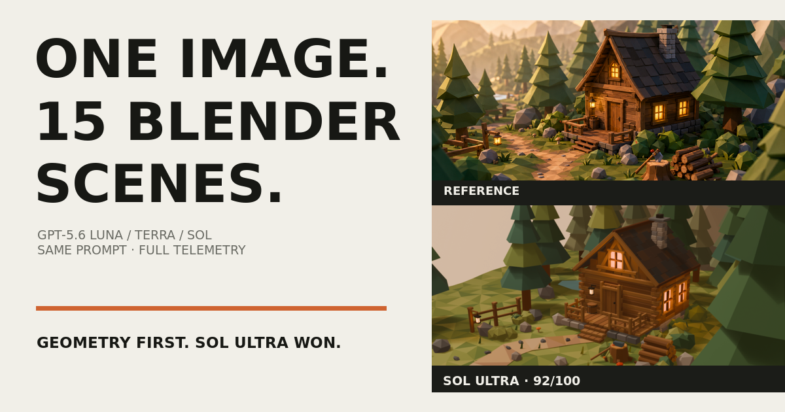
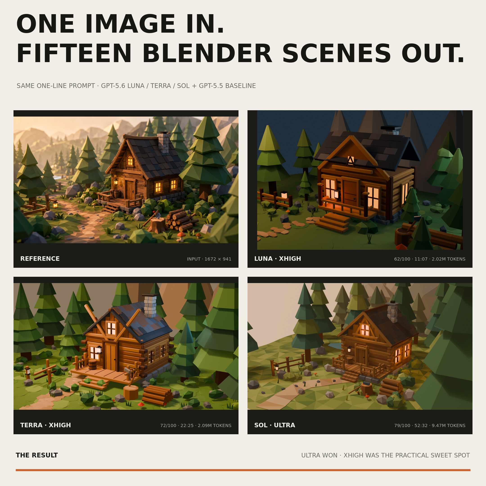
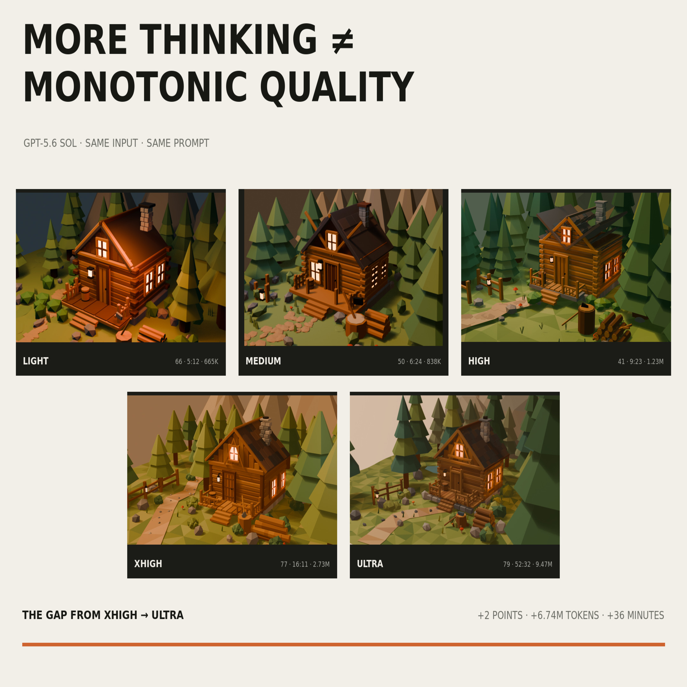
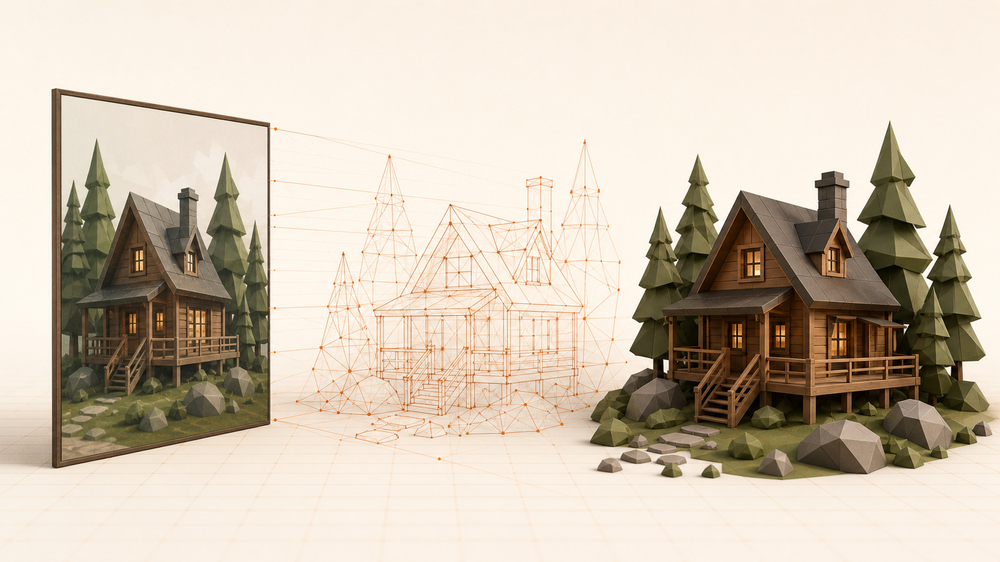

<p align="center">
  
</p>

<h1 align="center">GPT‑5.6 Blender Benchmark</h1>

<p align="center">
  One reference image. One deliberately thin prompt. Fifteen finished Blender scenes.
</p>

<p align="center">
  <a href="https://blender-bench.ralfboltshauser.com/"><strong>Explore the interactive benchmark</strong></a>
  ·
  <a href="site/assets/data/benchmark.csv">Raw data</a>
  ·
  <a href="https://www.linkedin.com/in/ralfboltshauser/">Ralf Boltshauser</a>
</p>

<p align="center">
  
  
  
  
</p>

---

This repository contains the full source artifacts behind an image-to-Blender capability probe across GPT‑5.6 **Luna**, **Terra**, and **Sol**, plus GPT‑5.5 xhigh as a baseline. Every run received the same image and the same instruction, then worked autonomously through Codex with shell and Blender access.

The interesting result is not simply that the largest configuration won. **More thinking raised the ceiling, but quality was not monotonic.** Some medium and high runs broke their central roof geometry; Sol Light placed fifth overall; Sol xhigh remained the practical runner-up, but finished seven points behind Ultra once structural logic became the benchmark's largest component.

## The practical shift

The score is only half of the result. In the broader image-to-Blender workflow, GPT‑5.6 changed how much hand-holding the model needed. GPT‑5.5 xhigh could make strong scenes, but recurring structural failures often required steering and corrective turns. GPT‑5.6 Sol Ultra can sometimes take the same thin one-shot prompt and get the difficult parts right immediately.

### 1. One-shot reliability moved up

The broken roof is a useful diagnostic. It is not a cosmetic detail: when the roof panels, rafters and gable separate, the primary cabin silhouette has failed. That failure appeared repeatedly in earlier GPT‑5.5 workflows. In this benchmark, some GPT‑5.6 runs, especially Sol Ultra, produced a coherent steep roof in the first autonomous pass. One run per configuration is not a statistical reliability study, but it captures a meaningful change in the practical baseline.

### 2. Ultra closes the visual feedback loop

Ultra does more than emit a longer Blender script. It can inspect the rendered image and identify clipped objects, overlaps, lighting balance and whether the scene has the intended feeling. That loop from geometry to rendered evidence to targeted correction is the important capability change. It explains why visual feedback can matter more than another layer of procedural detail.

### 3. Better orchestration is the next lever

The implication is not that every scene is now perfect in one call. It is that a workflow can spend its tokens on high-value visual checkpoints instead of hand-holding every modeling step. Full Blender scenes and larger worlds should become possible with much less token spend when the model can propose, render, inspect and correct its own work. That is a hypothesis for the next benchmark, not a claim this single sample proves.

## Scoring rubric

This is a geometry-first benchmark. A broken roof, floating house or physically implausible intersection is weighted more heavily than any other category.

| Factor | Weight | What is judged |
|---|---:|---|
| **Geometric logic** | **40** | Coherent roof, shell and foundation; grounded objects; clean attachments; no unintended intersections, disconnected parts or hovering geometry. |
| **Composition** | **25** | Camera, hierarchy, framing, leading path, balance, useful occlusion and layered scene depth. |
| **Visual finish** | **20** | Lighting hierarchy, exposure, color depth, material readability, atmosphere and overall beauty. |
| **Input match** | **15** | Cabin proportions, scene contents, camera, forest, path, props, palette and mood relative to the reference. |

Each score is the sum of four whole-point manual ratings. Ties break in the same priority order: geometry, then composition, visual finish and input match. Geometry asks whether the scene makes physical sense; input match asks whether it reconstructs this particular image.

## Headline results

| Choice | Run | Weighted score | Time | Reported tokens |
|---|---|---:|---:|---:|
| Best overall | **Sol Ultra** | **92 / 100** | 52:32 | 9.47M |
| Practical runner-up | **Sol xhigh** | **85 / 100** | 16:11 | 2.73M |
| Best value | **Sol Light** | **75 / 100** | 5:12 | 665K |
| Fastest complete run | **Luna Light** | **46 / 100** | 2:07 | 230K |

Scores are manual judgments under the rubric above. They are not normalized to force the best run near 100.

<p align="center">
  
</p>

## The experiment

### Input

- One byte-identical `1672 × 941` PNG for every run
- `2,170,819` bytes
- SHA‑256: `ceaae156b019483c4fb5a0255e6b800118a0462f1207bd1253368eb41311028c`
- Canonical copy: [`gpt-5.6-sol-ultra/reference.png`](gpt-5.6-sol-ultra/reference.png)

### Exact prompt

> Build this in Blender. Create and work in a subfolder named `{run}`.

No scene graph, modeling recipe, asset library, target camera, polygon budget, render settings, or intermediate guidance was provided.

### Environment

- Codex on one Ubuntu workstation
- Blender `5.0.1`
- One primary user turn per configuration
- Required outcome: editable `.blend`, generated Python builder, and final render
- Elapsed time includes shell work, Blender runs, inspection, debugging, and self-correction

### Tested matrix

| Model family | low | medium | high | xhigh | ultra |
|---|:---:|:---:|:---:|:---:|:---:|
| GPT‑5.6 Luna | ✓ | ✓ | ✓ | ✓ | n/a |
| GPT‑5.6 Terra | ✓ | ✓ | ✓ | ✓ | ✓ |
| GPT‑5.6 Sol | ✓ | ✓ | ✓ | ✓ | ✓ |
| GPT‑5.5 baseline | n/a | n/a | n/a | ✓ | n/a |

The original folder names use `light` for telemetry effort `low`, and `extra-high` for `xhigh`. There is no `max` run in the source artifacts, and no Luna Ultra run.

## Full results

| Rank | Run | Total | Geometry /40 | Composition /25 | Finish /20 | Match /15 | Time | Tokens |
|---:|---|---:|---:|---:|---:|---:|---:|---:|
| 1 | [Sol Ultra](gpt-5.6-sol-ultra/) | **92** | 38 | 24 | 17 | 13 | 52:32 | 9.47M |
| 2 | [Sol xhigh](gpt-5.6-sol-extra-high/) | **85** | 35 | 23 | 15 | 12 | 16:11 | 2.73M |
| 3 | [GPT‑5.5 xhigh](gpt-5.5-xhigh/) | **79** | 37 | 17 | 15 | 10 | 21:34 | 1.61M |
| 4 | [Terra xhigh](gpt-5.6-terra-extra-high/) | **77** | 29 | 21 | 16 | 11 | 22:25 | 2.09M |
| 5 | [Sol Light](gpt-5.6-sol-light/) | **75** | 34 | 18 | 14 | 9 | 5:12 | 665K |
| 6 | [Luna High](gpt-5.6-luna-high/) | **74** | 32 | 18 | 16 | 8 | 5:57 | 693K |
| 7 | [Terra Ultra](gpt-5.6-terra-ultra/) | **70** | 27 | 19 | 14 | 10 | 23:21 | 1.61M |
| 8 | [Luna xhigh](gpt-5.6-luna-extra-high/) | **69** | 28 | 19 | 13 | 9 | 11:07 | 2.02M |
| 9 | [Sol Medium](gpt-5.6-sol-medium/) | **62** | 21 | 19 | 14 | 8 | 6:24 | 838K |
| 10 | [Terra High](gpt-5.6-terra-high/) | **60** | 25 | 15 | 12 | 8 | 8:10 | 764K |
| 11 | [Sol High](gpt-5.6-sol-high/) | **57** | 14 | 21 | 15 | 7 | 9:23 | 1.23M |
| 12 | [Luna Light](gpt-5.6-luna-light/) | **46** | 19 | 14 | 8 | 5 | 2:07 | 230K |
| 13 | [Terra Medium](gpt-5.6-terra-medium/) | **45** | 17 | 13 | 9 | 6 | 4:05 | 246K |
| 14 | [Terra Light](gpt-5.6-terra-light/) | **39** | 13 | 13 | 8 | 5 | 3:47 | 245K |
| 15 | [Luna Medium](gpt-5.6-luna-medium/) | **39** | 9 | 15 | 11 | 4 | 3:32 | 248K |

Terra Light wins the 39-point tie on geometry, `13` to `9`. The audited machine-readable table includes all four component scores alongside input, cached input, output, reasoning, tool-call, scene and file data in [`site/assets/data/benchmark.csv`](site/assets/data/benchmark.csv).

## What the renders show

### 1. Ultra won clearly

Sol Ultra scored `92/100`, with the best geometry, composition and input match plus the richest overall finish. Sol xhigh reached `85/100` with **28.8% of the tokens** and **30.8% of the time**. The final seven points cost another `6.74M` tokens and roughly 36 minutes.

### 2. Geometry changes the ranking

GPT‑5.5 xhigh rises to third on the strength of a `37/40` geometry score. Terra xhigh remains visually rich, but crossed roof braces and protruding beams hold it to fourth. Terra Ultra looks attractive, yet its floating plinth, porch and lowest stair pull it down to seventh.

### 3. Sol Light was the value surprise

At `665K` tokens and `5:12`, Sol Light ranked fifth and beat ten configurations. Its builder is only 167 lines, but the important result is visual: it keeps the roof and cabin coherent while several more expensive runs break their primary structure.

### 4. Reasoning effort was non-monotonic

Sol Medium and High produced visibly separated or exploded roof geometry. Terra xhigh outscored Terra Ultra by seven points. Luna xhigh spent 2.9× the tokens of Luna High and still scored five points lower.

<p align="center">
  
</p>

### 5. Every configuration still delivered

All 15 `.blend` files reopen in Blender 5.0.1, and all expected renders are valid and nonblank. Most GPT‑5.6 runs initially used stale Blender API assumptions, especially the `BLENDER_EEVEE_NEXT` enum, and recovered through diagnosis, patching, and re-rendering.

### 6. This is semantic reconstruction, not inverse graphics

None of the generated scripts loads, samples, measures, or camera-calibrates against the reference. The agents infer “cozy low-poly forest cabin” and hand-build a plausible scene from primitives. That is useful visual understanding and tool execution, but it is not strict recovery of the pictured 3D scene.

## What the scripts reveal

The strongest builds were separated less by raw polygon count than by four modeling decisions:

1. **Coherent geometry:** continuous terrain, tapered paths, and dimensionally correct gables instead of stacked decorative slabs.
2. **Composition before detail:** framing trees, a leading path, fence, woodpile, foreground props, and distant mountains.
3. **Lighting hierarchy:** warm local window lights, a broad key, and cooler environmental fill.
4. **Controlled placement:** keeping the path, door, windows, and silhouette readable while adding vegetation.

Sol xhigh is the best engineering balance in this set: five meaningful collections, reusable geometry helpers, deterministic terrain, custom mountains, and 499 meshes. Sol Ultra is the most ambitious. Terra Ultra has disciplined vegetation placement logic, but misses the cabin's ground offset. GPT‑5.5 xhigh is the most software-like standalone builder.

<p align="center">
  
</p>

<p align="center"><sub>The image above is an editorial illustration, not a benchmark output.</sub></p>

## Interactive Sol Ultra model

The page now includes a live Three.js view of the highest-scoring scene. This is an optimized presentation derivative, not a replacement for the original benchmark artifact. The `.blend`, generated builder and final render remain untouched.

The source scene is a textureless, flat-color low-poly build. Its 51 materials preserve color, but they do not carry the Eevee lighting that gave the final render its depth. A generic browser light rig could keep the model small, but it could not reproduce the authored shadows, warm windows and environmental contrast.

| Asset property | Source scene | Web derivative |
|---|---:|---:|
| Mesh objects or primitives | 707 | 2 |
| Evaluated triangles | 51,031 | 49,265 |
| Materials | 51 | 2 unlit materials |
| Image textures | 0 | two 1024 px lighting atlases |
| Texture memory | 0 | about 11.2 MB with mipmaps |
| Binary size | 2.78 MB initial GLB | 597 KB optimized GLB |

The build pipeline:

1. Evaluates the 396 bevel modifiers so the browser receives the intended geometry.
2. Removes the fixed-camera sky card, unsupported volume fog and two foreground crop trees.
3. Consolidates the scene into a subject mesh and an environment mesh, then creates unique non-overlapping UVs for each.
4. Bakes 128-sample Cycles Combined lighting into two 1024 × 1024 lossless PNG masters.
5. Exports those meshes as `KHR_materials_unlit`, so Three.js does not need runtime lights or shadow maps.
6. Converts the embedded delivery textures to WebP, then applies quantization, pruning and Meshopt compression.

Two 1K atlases tested better than one 2K atlas here. They give the cabin its own UV domain, reduce decoded texture memory by half and produce a smaller delivered GLB. WebP keeps the browser path native and simple. KTX2 could reduce GPU memory further, but would add a transcoder for an ambient hero asset that already stays near 11 MB. The decision is measured for this scene rather than treated as a universal rule. See Blender's [Cycles baking documentation](https://docs.blender.org/manual/en/5.0/render/cycles/baking.html), the [Three.js glTF loader](https://threejs.org/docs/pages/GLTFLoader.html) and Khronos's [KTX guidance](https://www.khronos.org/ktx/) for the underlying tradeoffs.

The viewer is also intentionally restrained:

- It keeps the WebP render as the fast first paint and fallback, then crossfades into the live scene as soon as the GLB is ready.
- The default camera moves through a gentle eight-second loop, making the depth and interactivity visible without requiring hover discovery.
- The first deliberate canvas interaction stops the ambient loop and hands full orbit control to the visitor.
- Reduced-motion visitors receive the live scene without ambient movement; save-data connections keep the explicit launch step.
- Orbit, pitch and zoom are bounded to the useful front hemisphere because the scene was authored for one camera.
- Ambient rendering is capped at 30 fps and pauses offscreen or in a hidden tab. After interaction, rendering returns to an event-driven loop following Three.js's [render-on-demand guidance](https://threejs.org/manual/en/rendering-on-demand.html).
- Drawing resolution is capped by a pixel budget instead of blindly using the device's full pixel ratio.

Rebuild the model and bundled viewer with Blender 5.0.1, Node.js and npm:

```bash
npm ci
npm run build
```

The reproducible export is in [`scripts/build_web_model.py`](scripts/build_web_model.py), the viewer source is in [`src/hero-viewer.js`](src/hero-viewer.js), and the generated asset report is in [`site/assets/models/sol-ultra-diorama.json`](site/assets/models/sol-ultra-diorama.json).

## Repository layout

```text
.
├── gpt-5.5-xhigh/                 # GPT-5.5 baseline: builder, .blend, render
├── gpt-5.6-luna-{light,...}/      # Four Luna configurations
├── gpt-5.6-terra-{light,...}/     # Five Terra configurations
├── gpt-5.6-sol-{light,...}/       # Five Sol configurations
├── site/
│   ├── index.html                 # Zero-build interactive article
│   ├── app.js                     # Result data, filters, chart, dialogs
│   ├── hero-viewer.js             # Bundled Three.js progressive enhancement
│   ├── styles.css                 # Responsive editorial presentation
│   ├── assets/data/benchmark.csv  # Audited benchmark data
│   ├── assets/models/              # Baked atlases, optimized GLB, build report
│   ├── assets/renders/            # Web-optimized reference and renders
│   ├── assets/social/             # Comparison and editorial visuals
│   └── downloads/                 # Normalized .blend and script files
├── src/hero-viewer.js             # Three.js source with bounded OrbitControls
├── scripts/build_web_model.py     # Blender lighting-bake and GLB pipeline
├── scripts/validate.sh            # No-dependency repository checks
├── package.json                   # Pinned Three.js and glTF build tools
└── .github/workflows/validate.yml # CI validation
```

Blender `.blend1` backup files, Python caches, local Codex histories, and Vercel project state are intentionally excluded.

## Explore locally

The article is a zero-build static site:

```bash
python3 -m http.server 4173 -d site
```

Then open [`http://localhost:4173`](http://localhost:4173).

To inspect a result, open the `.blend` in its model folder or use the normalized files under `site/downloads/`.

The Python builders are preserved as generated. Several contain original host-specific output paths or Blender 5.0.1 API assumptions, so inspect paths before rebuilding. A typical headless invocation is:

```bash
cd gpt-5.6-sol-ultra
blender --background --python create_scene.py
```

## Validate the repository

```bash
bash scripts/validate.sh
```

The same checks run in GitHub Actions: JavaScript syntax, artifact counts, CSV totals, public links, and the absence of private/local publication state.

## Methodology and accounting

The primary telemetry source was the local Codex session record for each completed task, corroborated against artifact paths, timestamps, and saved Blender scenes.

- Reported token total = input + output
- Cached input is a subset of input
- Reasoning output is a subset of output
- Sol Ultra and Terra Ultra include marginal usage from spawned child agents
- Child histories inherit a parent token baseline; that inherited baseline was subtracted rather than double-counted
- Dollar cost is not estimated because these were subscription-backed Codex runs without a per-model API billing record

The weighted rubric is:

- Geometric logic: 40
- Composition: 25
- Lighting, color and visual finish: 20
- Accuracy to the input image: 15

All four ratings are whole-point manual judgments made from the final render, with the editable `.blend` and generated builder used to resolve ambiguous geometry. Totals are simple sums; ties follow the same priority order.

## Caveats

- One output per configuration is a capability probe, not a variance or reliability study.
- Resolutions, aspect ratios, cameras, Eevee settings, and color management were model-selected rather than normalized.
- Only eight of 15 outputs stayed near the source's 16:9 framing; every Luna output drifted.
- The matrix has no `max` run and no Luna Ultra run.
- Input-match scores measure resemblance to this specific reference. Geometry, composition and visual-finish scores also measure general scene quality under the published rubric.
- More objects, polygons, code, or tokens are not automatically evidence of a better scene.

---

Built and audited by [Ralf Boltshauser](https://www.linkedin.com/in/ralfboltshauser/). If you are running similar agent benchmarks, feel free to reach out.
